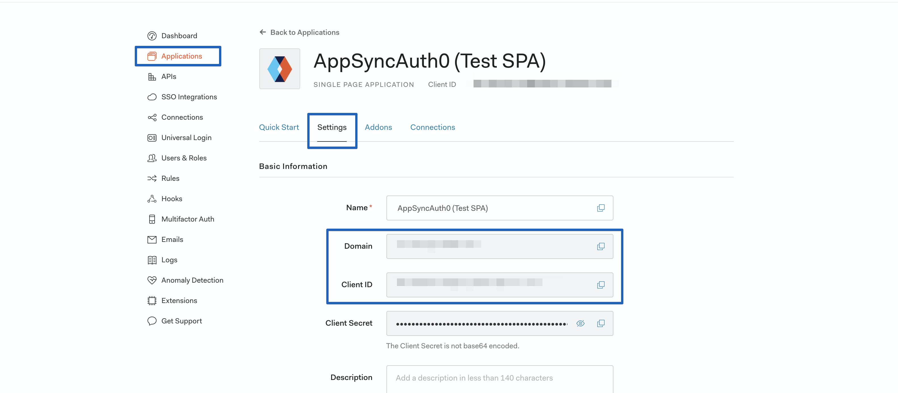
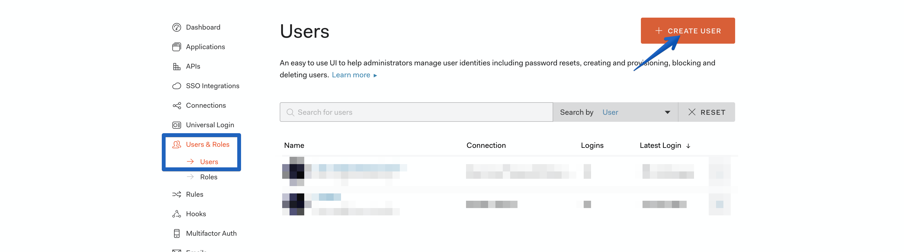
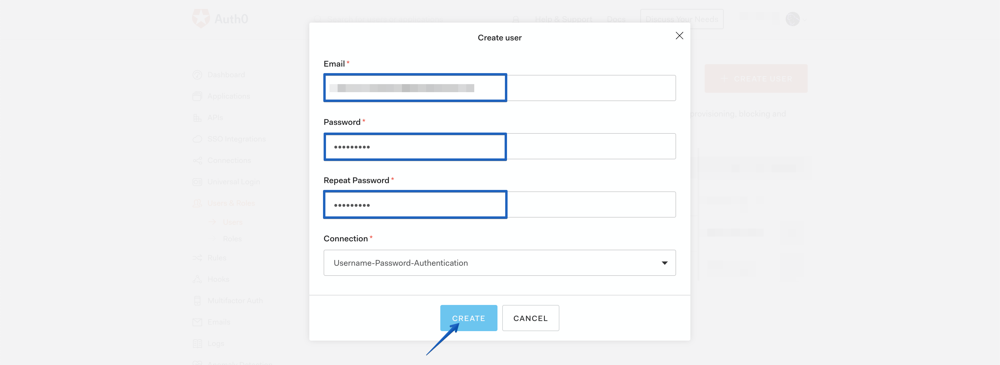
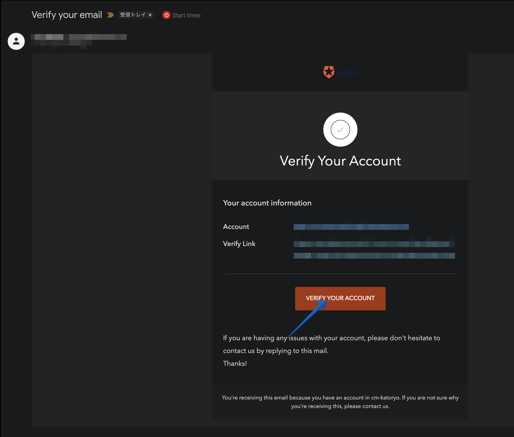
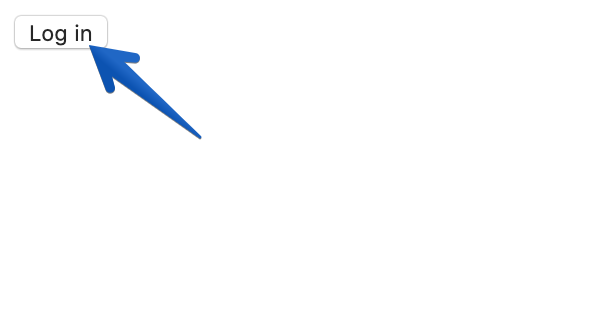
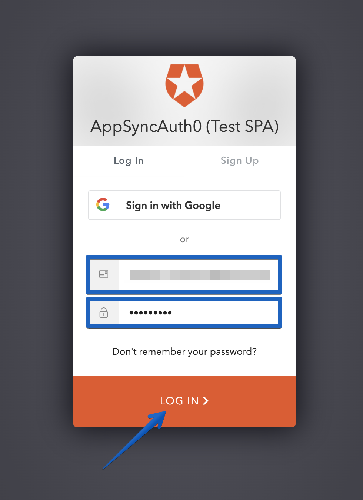
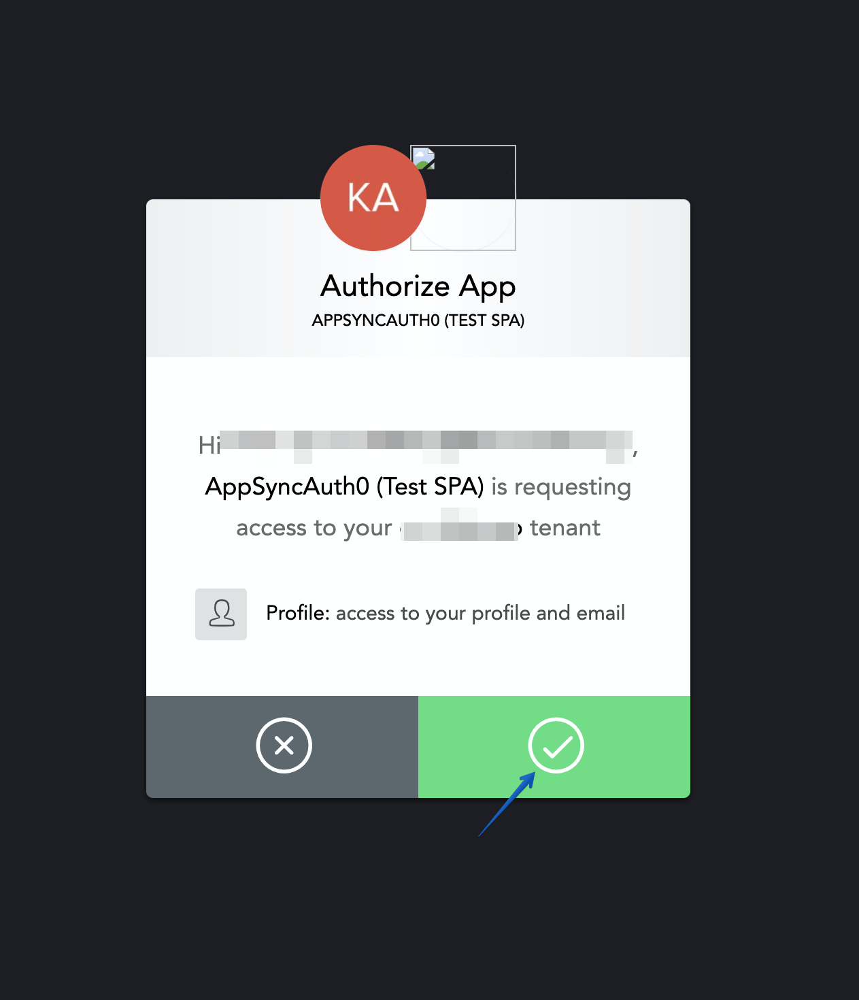
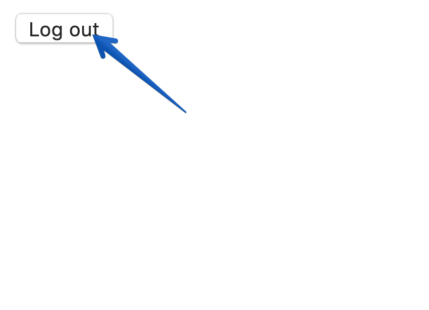
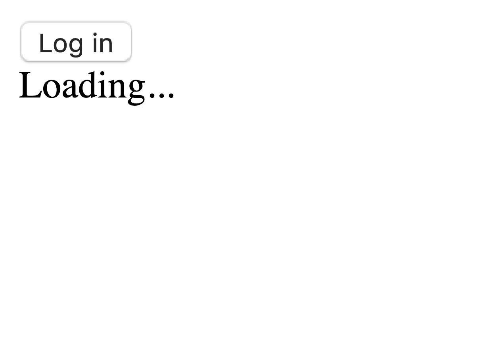
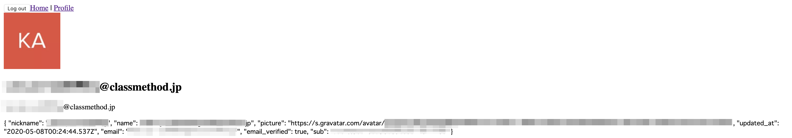

# Reactでサンプルアプリを構築する

作成したAppSyncにを利用するフロントエンドアプリケーションをReactで作成しましょう．

<!-- TODO: Reactに関する簡単な説明 -->
TODO: Reactに関する簡単な説明 Lorem Ipsum is simply dummy text of the printing and typesetting industry. Lorem Ipsum has been the industry's standard dummy text ever since the 1500s, when an unknown printer took a galley of type and scrambled it to make a type specimen book. It has survived not only five centuries, but also the leap into electronic typesetting, remaining essentially unchanged. It was popularised in the 1960s with the release of Letraset sheets containing Lorem Ipsum passages, and more recently with desktop publishing software like Aldus PageMaker including versions of Lorem Ipsum

## Create React Appを使ってセットアップする

Create React App（CRA）を使ってアプリケーションを生成します．任意の作業用ディレクトリに移動後、下記のコマンドを実行します．

```bash
npx create-react-app@3.4.1 --template typescript react-appsync-protected-by-auth0
cd react-appsync-protected-by-auth0
```

React RouterとAuth0のSPA用SDKをインストールします．

```bash
yarn add react-router-dom@5.1.2 @auth0/auth0-spa-js@1.8.1
yarn add -D @types/react-router-dom@5.1.2
```

Auth0をReactで利用する為のCustom Hookを作成します．

```typescript
// ./src/react-auth0-spa.tsx
import React from 'react';
import createAuth0Client, {
  Auth0Client, Auth0ClientOptions,
  getIdTokenClaimsOptions, GetTokenSilentlyOptions, GetTokenWithPopupOptions, IdToken, LogoutOptions,
  PopupConfigOptions,
  PopupLoginOptions, RedirectLoginOptions,
} from '@auth0/auth0-spa-js';

type Auth0ContextOptions = {
  isAuthenticated: boolean;
  user: any;
  loading: boolean;
  popupOpen: boolean;
  loginWithPopup: (options?: PopupLoginOptions, config?: PopupConfigOptions) => Promise<void>;
  handleRedirectCallback: (path?: string) => Promise<void>;
  getIdTokenClaims: (options?: getIdTokenClaimsOptions) => Promise<IdToken>;
  loginWithRedirect: (options?: RedirectLoginOptions) => Promise<void>;
  getTokenSilently: (options?: GetTokenSilentlyOptions) => Promise<any>;
  getTokenWithPopup: (options?: GetTokenWithPopupOptions, config?: PopupConfigOptions) => Promise<string>;
  logout: (options?: LogoutOptions) => void;
}

export type Auth0ProviderOptions = Auth0ClientOptions & {
  children: React.ReactElement;
  onRedirectCallback: Auth0ContextOptions['handleRedirectCallback'];
}

export const Auth0Context = React.createContext({} as Auth0ContextOptions);
export const useAuth0 = () => React.useContext<Auth0ContextOptions>(Auth0Context);
export const Auth0Provider: React.FC<Auth0ProviderOptions> = (
  {
    children,
    onRedirectCallback,
    ...initOptions
  }
) => {
  const [isAuthenticated, setIsAuthenticated] = React.useState<boolean>(false);
  const [user, setUser] = React.useState<any>(null);
  const [auth0Client, setAuth0] = React.useState<Auth0Client>();
  const [loading, setLoading] = React.useState<boolean>(true);
  const [popupOpen, setPopupOpen] = React.useState<boolean>(false);

  React.useEffect(() => {
    const initAuth0 = async () => {
      const auth0FromHook = await createAuth0Client(initOptions);
      setAuth0(auth0FromHook);

      if (window.location.search.includes('code=') &&
        window.location.search.includes('state=')) {
        const {appState} = await auth0FromHook.handleRedirectCallback();
        await onRedirectCallback(appState?.targetUrl);
      }

      const isAuthenticated = await auth0FromHook.isAuthenticated();

      setIsAuthenticated(isAuthenticated);

      if (isAuthenticated) {
        const user = await auth0FromHook.getUser();
        setUser(user);
      }

      setLoading(false);
    };
    initAuth0();
    // eslint-disable-next-line
  }, []);

  const loginWithPopup: Auth0ContextOptions['loginWithPopup'] = async (options, config) => {
    setPopupOpen(true);
    try {
      await auth0Client!.loginWithPopup(options, config);
    } catch (error) {
      console.error(error);
    } finally {
      setPopupOpen(false);
    }
    const user = await auth0Client!.getUser();
    setUser(user);
    setIsAuthenticated(true);
  };

  const handleRedirectCallback: Auth0ContextOptions['handleRedirectCallback'] = async (url) => {
    setLoading(true);
    await auth0Client!.handleRedirectCallback(url);
    const user = await auth0Client!.getUser();
    setLoading(false);
    setIsAuthenticated(true);
    setUser(user);
  };

  return (
    <Auth0Context.Provider
      value={{
        isAuthenticated,
        user,
        loading,
        popupOpen,
        loginWithPopup,
        handleRedirectCallback,
        getIdTokenClaims: (options) => auth0Client!.getIdTokenClaims(options),
        loginWithRedirect: (options) => auth0Client!.loginWithRedirect(options),
        getTokenSilently: (options) => auth0Client!.getTokenSilently(options),
        getTokenWithPopup: (options, config) => auth0Client!.getTokenWithPopup(options, config),
        logout: (options) => auth0Client!.logout(options)
      }}
    >
      {children}
    </Auth0Context.Provider>
  );
};
```

ログイン／ログアウト操作を行わせる為にNavBarを作成します．

```typescript
// ./src/components/NavBar.tsx
import React from "react";
import { useAuth0 } from "../react-auth0-spa";

export const NavBar = () => {
  const { isAuthenticated, loginWithRedirect, logout } = useAuth0();

  return (
    <div>
      {!isAuthenticated && (
        <button onClick={() => loginWithRedirect({})}>Log in</button>
      )}

      {isAuthenticated && <button onClick={() => logout()}>Log out</button>}
    </div>
  );
};

```

historyを生成し、どこからでもアクセスが出来るようにします．
TODO: この部分の説明が怪しい
useHistory() Hookを使わずに、createBrowserHistory()を使っているのは、前者はRouteコンポーネント配下でしか使えないが、後者はどこでも使える（少なくともpushの定義は出来る）からです．

```typescript
import { createBrowserHistory } from "history";
export const history = createBrowserHistory();
```

Auth0の設定をアプリケーションが取り込めるようにJSON形式で保存します．先程作成した、Auth0のApplication定義のSettingsタブからDomainとClient IDを転記してください．
今回はサンプルアプリケーションなので、環境（dev/stg/prd）差分を考慮せずパラメーターをハードコートしています．




```json
# ./src/auth-config.json
{
  "domain": "YOUR_DOMAIN",
  "clientId": "YOUR_CLIENT_ID"
}
```

作成したAuth0 Custom Hookをアプリケーションに結合させる為に、`index.tsx`を編集します．

```typescript
// ./src/index.tsx
import React from 'react';
import ReactDOM from 'react-dom';
import { App } from './App';
import * as serviceWorker from './serviceWorker';
import { history } from './utils/history';
import { Auth0Provider } from "./react-auth0-spa";
import config from "./auth_config.json";

const onRedirectCallback = async (url?: string) => {
  history.push(url ?? window.location.pathname);
};

ReactDOM.render(
  <React.StrictMode>
    <Auth0Provider
      domain={config.domain}
      client_id={config.clientId}
      redirect_uri={window.location.origin}
      onRedirectCallback={onRedirectCallback}
    >
      <App />
    </Auth0Provider>
  </React.StrictMode>,
  document.getElementById('root')
);

// If you want your app to work offline and load faster, you can change
// unregister() to register() below. Note this comes with some pitfalls.
// Learn more about service workers: https://bit.ly/CRA-PWA
serviceWorker.unregister();

```

CRAで生成されたCSS等使わないので削除してしまいましょう．

- logo.svg
- index.tsx
- index.css
- App.css
- App.test.tsx

アプリケーションを実行して、ログインが出来るか確認します．

まず、テスト用のユーザーをAuth0に作成します．Auth0のDashbordを開き、**Users & Roles**、**Users**とメニューを選択し、**CREATE USER**を選択します．



ユーザーのEmailとPasswordを入力し、**CREATE**を選択します．



ベリファイのメールが届くのでリンクをクリックして、ユーザーを使用可能な状態に遷移させます．



ユーザーの準備ができたので、アプリケーションを実行しログインが行えるか確認します．下記のコマンドで実行すると、デフォルトブラウザで [http://loclahost:3000](http://loclahost:3000) が開きます．自動でブラウザが開かない場合は手動でURLを入力してアクセスしてください．

```bash
yarn start
```

ブラウザで素朴な画面が表示されるので、Log inボタンを選択します．



Auth0のユニバーサルログイン画面にリダイレクトされるので、テストユーザーのEmailとPasswordを入力し、**LOG IN**を選択します．



アプリケーションに対する認可を確認されるのでチェックアイコンを選択します．アプリケーションにアイコンを設定していないので、画像が表示されていませんね．



一瞬、**Loading...**と表示された後に、**Log out**ボタンだけの素朴な画面に戻れば成功です．

**Log out**を選択してログアウトしておきます．以降もアプリケーションを編集する前にはログアウトしてから行います．特に後ほど**audience**を設定する際には事前にログアウトが必須です．




## プロフィール画面にユーザー情報を表示する

**Token**の情報を表示するプロフィール画面を作成します．**Token**から情報を表示するのでログイン済みである必要があります．これに対応する為に、ログインしていなければAuth0のユニバーサルログイン画面へリダイレクトするPrivate Routeコンポーネントを作成します．

プロフィール画面を作成します．Auth0 Custom Hookからユーザー情報を取得し、表示します．

```typescript
// ./src/components/Profile.tsx
import React  from "react";
import { useAuth0 } from "../react-auth0-spa";

export const Profile = () => {
  const { loading, user } = useAuth0();

  if (loading || !user) {
    return <div>Loading...</div>;
  }

  return (
    <>
      

      <h2>{user.name}</h2>
      <p>{user.email}</p>
      <code>{JSON.stringify(user, null, 2)}</code>
    </>
  );
};
```

`NavBar.tsx`を変更し、Profile画面に移動できるようにします．

```tsx
// ./src/components/NavBar.tsx
import React from 'react';
import { useAuth0 } from '../react-auth0-spa';
import { Link } from 'react-router-dom';

export const NavBar = () => {
  const {isAuthenticated, loginWithRedirect, logout} = useAuth0();

  return (
    <div>
      {!isAuthenticated && (
        <button onClick={() => loginWithRedirect()}>Log in</button>
      )}
      {isAuthenticated && (
        <>
          <button onClick={() => logout()}>Log out</button>
          <span>
            <Link to="/">Home</Link> | <Link to="/profile">Profile</Link>
          </span>
        </>
      )}
    </div>
  );
};

```

`App.tsx`を変更しProfile画面へのルーティングを定義します．

```typescript
// ./src/App.tsx
import React from "react";
import { NavBar } from "./components/NavBar";
import { Router, Route, Switch } from "react-router-dom";
import { Profile } from "./components/Profile";
import { history } from "./utils/history";

export const App = () => {
  return (
    <div className="App">
      <Router history={history}>
        <header>
          <NavBar />
        </header>
        <Switch>
          <Route path="/" exact />
          <Route path="/profile" component={Profile} />
        </Switch>
      </Router>
    </div>
  );
};

```

まだ、リダイレクトが設定されていないので、下記のURLへアクセスするとLoading状態のまま遷移しません．

[http://localhost:3000/profile](http://localhost:3000/profile)



Private Route コンポーネントを作成します．このコンポーネントは React RouterのRouteコンポーネントのWrapperでログインしていなければ、ユニバーサルログイン画面にリダイレクトします．

```typescript
// ./src/components/PrivateRoute.tsx
import React from 'react';
import { Route, RouteProps } from 'react-router-dom';
import { useAuth0 } from '../react-auth0-spa';

export const PrivateRoute: React.FC<RouteProps> = ({ component: Component, path, ...rest }) => {
  const { loading, isAuthenticated, loginWithRedirect } = useAuth0();

  React.useEffect(() => {
    if (loading || isAuthenticated) {
      return;
    }
    const fn = async () => {
      await loginWithRedirect({
        appState: {targetUrl: window.location.pathname}
      });
    };
    fn();
  }, [loading, isAuthenticated, loginWithRedirect, path]);

  const render: RouteProps['render'] = props => {
    if (isAuthenticated && Component != null) {
      return <Component {...props} />;
    }

    return null;
  };

  return <Route path={path} render={render} {...rest} />;
};

```

`App.tsx`を変更して、Profile画面をPrivate Routeで保護します．

```typescript
import React from "react";
import { NavBar } from "./components/NavBar";
import { Router, Route, Switch } from "react-router-dom";
import { Profile } from "./components/Profile";
import { history } from "./utils/history";
import { PrivateRoute } from './components/PrivateRoute';

export const App = () => {
  return (
    <div className="App">
      <Router history={history}>
        <header>
          <NavBar />
        </header>
        <Switch>
          <Route path="/" exact />
          <PrivateRoute path="/profile" component={Profile} />
        </Switch>
      </Router>
    </div>

  );
};

```

アプリケーションを実行して、ログアウト状態でProfile画面にアクセスしようとするとリダイレクトされるか確認します．ログアウトした状態で下記のURLへアクセスします．

[http://localhost:3000/profile](http://localhost:3000/profile)

Auth0のユニバーサルログイン画面へリダイレクトされるので、EmailとPasswordを入力します．

Profile画面が表示されます．表示を確認できたら、ログアウトしておきます．



## Schemaの取得と型とHooksを生成する

AppSync Schema（GraphQL Schema）から型とReact Custom Hookを生成します．

一度セットアップしてしまえば、スクリプトを実行するだけでSchemaを元に何度でも再生成が可能です．

AWS CLIを使ってSchemaを取得します．当然ですがAppSyncだから出来る方法です，それ以外でGraphQLを利用している場合は，エンドポイントに対してコードジェネレーターが直接Schemaをリクエストする事ができます．もちろんファイルとしてSchemaを共有しても問題はありません．

AWS CLIをがインストールされていない場合は，下記のドキュメントを参考にインストールしてください．  
[AWS CLI バージョン 2 のインストール](https://docs.aws.amazon.com/ja_jp/cli/latest/userguide/install-cliv2.html)

Schema用のディレクトリを作成して，Schemaをダウンロードします．

```bash
mkdir -p src/graphql && \
aws appsync get-introspection-schema --api-id ${APP_SYNC_API_ID} --format SDL --include-directives src/graphql/schema.graphql
```

Documents（クエリ、ミューテーション、サブスクリプションのリクエスト）が無いとReact Custom Hookの生成は行えないので、SchemaからDocumentsを生成します．パッケージ名からわかるようにAmplify関連のパッケージなのですが、マルチパッケージで開発されているのでピンポイントで欲しい部分だけ使えて助かります．

生成されるDocumentsはレスポンスに全ての項目を要求する為、必要な項目だけ取得できるというGraphQLのメリットを殺してしまいます．これを嫌う場合は、手動でDocumentsを作成してください．

```bash
yarn add -D amplify-graphql-docs-generator@2.1.13
yarn amplify-graphql-docs-generator --schema src/graphql/schema.graphql --output src/graphql/all-operations.graphql --language graphql
```

SchemaとDocumentから型とReact Custom Hookを生成します．

必要なツールをインストールします．

```bash
yarn add \
  graphql@15.0.0 \
  @apollo/react-common@3.1.4 \
  @apollo/react-hooks@3.1.5

yarn add -D \
  @graphql-codegen/cli@1.13.5 \
  @graphql-codegen/typescript@1.13.5 \
  @graphql-codegen/typescript-operations@1.13.5 \
  @graphql-codegen/typescript-react-apollo@1.13.5 
```

graphql-codegenの設定ファイルを作成します． この設定に基づいて型やHookが生成されます、TypeScriptのEnum使いたくないので、enumsAsTypesを有効にしてTypesに変換しています．好みに合わせて、カスタマイズしたい場合は公式ドキュメントを確認してください．

[typescript | GraphQL Code Generator](https://graphql-code-generator.com/docs/generated-config/typescript#enumsastypes-boolean-default-value-false)

```yaml
# ./codegen.yml 
overwrite: true
schema:
  - './src/graphql/schema.graphql'
documents:
  - './src/graphql/all-operations.graphql'
generates:
  src/graphql/generated.tsx:
    plugins:
      - 'typescript'
      - 'typescript-operations'
      - 'typescript-react-apollo'
    config:
      withComponent: false
      withHooks: true
      withHOC: false
      enumsAsTypes: true
```

型とReact Custom Hooksを生成します．

```bash
yarn graphql-codegen --config codegen.yml
```

Schemaに変更があった場合に簡単に再生成ができるように、NPM Scriptsを書いておきます．これで yarn codegen とする事で再生成が行なえます．

```json
// ./package.json
...,
"scripts": {
		...
		"codegen:get-schema": "aws appsync get-introspection-schema --api-id ${APP_SYNC_API_ID} --format SDL --include-directives src/graphql/schema.graphql",
		"codegen:docsgen": "amplify-graphql-docs-generator --schema src/graphql/schema.graphql --output src/graphql/all-operations.graphql --language graphql",
	  "codegen": "yarn codegen:get-schema && yarn codegen:docsgen && graphql-codegen --config codegen.yml"
  },
...
```

各クエリー、ミューテーション、サブスクリプションに対するApollo ClientのReact Custom Hookが生成されました．Apollo Clientはかなりインテリジェントでfetch moreやpolling処理などが実装済みです．
この様にフロントエンドとバックエンドで型を共有し、さらにAPIアクセス部分のコードを自動生成できる事は、AppSync（GraphQL）使う非常に大きなメリットです。
取得・生成されたファイルは付録の章で確認できます．

## 付録

### 取得したSchema

```graphql
##  ./src/graphql/schema.graphql
schema {
  query: Query
  mutation: Mutation
  subscription: Subscription
}

type Comment {
  #  A unique identifier for the comment.
  commentId: String!
  #  The comment's content.
  content: String!
  #  The comment timestamp. This field is indexed to enable sorted pagination.
  createdAt: String!
  #  The id of the comment's parent event.
  eventId: ID!
}

type CommentConnection {
  items: [Comment]
  nextToken: String
}

type Event {
  #  Paginate through all comments belonging to an individual post.
  comments(limit: Int, nextToken: String): CommentConnection
  description: String
  id: ID!
  name: String
  when: String
  where: String
}

type EventConnection {
  items: [Event]
  nextToken: String
}

type Mutation {
  #  Comment on an event.
  commentOnEvent(content: String!, createdAt: String!, eventId: ID!): Comment
  #  Create a single event.
  createEvent(description: String!, name: String!, when: String!, where: String!): Event
  #  Delete a single event by id.
  deleteEvent(id: ID!): Event
}

type Query {
  #  Get a single event by id.
  getEvent(id: ID!): Event
  #  Paginate through events.
  listEvents(filter: TableEventFilterInput, limit: Int, nextToken: String): EventConnection
}

type Subscription {
  subscribeToEventComments(eventId: String!): Comment
}

input TableBooleanFilterInput {
  eq: Boolean
  ne: Boolean
}

input TableEventFilterInput {
  description: TableStringFilterInput
  id: TableIDFilterInput
  name: TableStringFilterInput
  when: TableStringFilterInput
  where: TableStringFilterInput
}

input TableFloatFilterInput {
  between: [Float]
  contains: Float
  eq: Float
  ge: Float
  gt: Float
  le: Float
  lt: Float
  ne: Float
  notContains: Float
}

input TableIDFilterInput {
  beginsWith: ID
  between: [ID]
  contains: ID
  eq: ID
  ge: ID
  gt: ID
  le: ID
  lt: ID
  ne: ID
  notContains: ID
}

input TableIntFilterInput {
  between: [Int]
  contains: Int
  eq: Int
  ge: Int
  gt: Int
  le: Int
  lt: Int
  ne: Int
  notContains: Int
}

input TableStringFilterInput {
  beginsWith: String
  between: [String]
  contains: String
  eq: String
  ge: String
  gt: String
  le: String
  lt: String
  ne: String
  notContains: String
}
```

### 生成されたDocuments

```graphql
# ./src/graphql/all-operation.graphql
# this is an auto generated file. This will be overwritten
query GetEvent($id: ID!) {
  getEvent(id: $id) {
    comments {
      nextToken
    }
    description
    id
    name
    when
    where
  }
}
query ListEvents(
  $filter: TableEventFilterInput
  $limit: Int
  $nextToken: String
) {
  listEvents(filter: $filter, limit: $limit, nextToken: $nextToken) {
    items {
      description
      id
      name
      when
      where
    }
    nextToken
  }
}
mutation CommentOnEvent($content: String!, $createdAt: String!, $eventId: ID!) {
  commentOnEvent(content: $content, createdAt: $createdAt, eventId: $eventId) {
    commentId
    content
    createdAt
    eventId
  }
}
mutation CreateEvent(
  $description: String!
  $name: String!
  $when: String!
  $where: String!
) {
  createEvent(
    description: $description
    name: $name
    when: $when
    where: $where
  ) {
    comments {
      nextToken
    }
    description
    id
    name
    when
    where
  }
}
mutation DeleteEvent($id: ID!) {
  deleteEvent(id: $id) {
    comments {
      nextToken
    }
    description
    id
    name
    when
    where
  }
}
subscription SubscribeToEventComments($eventId: String!) {
  subscribeToEventComments(eventId: $eventId) {
    commentId
    content
    createdAt
    eventId
  }
}
```

### 生成された型とReact Custom Hook

```tsx
// ./src/graphql/generated.tsx
import gql from 'graphql-tag';
import * as ApolloReactCommon from '@apollo/react-common';
import * as ApolloReactHooks from '@apollo/react-hooks';
export type Maybe<T> = T | null;
/** All built-in and custom scalars, mapped to their actual values */
export type Scalars = {
  ID: string;
  String: string;
  Boolean: boolean;
  Int: number;
  Float: number;
};

export type Comment = {
   __typename?: 'Comment';
  commentId: Scalars['String'];
  content: Scalars['String'];
  createdAt: Scalars['String'];
  eventId: Scalars['ID'];
};

export type CommentConnection = {
   __typename?: 'CommentConnection';
  items?: Maybe<Array<Maybe<Comment>>>;
  nextToken?: Maybe<Scalars['String']>;
};

export type Event = {
   __typename?: 'Event';
  comments?: Maybe<CommentConnection>;
  description?: Maybe<Scalars['String']>;
  id: Scalars['ID'];
  name?: Maybe<Scalars['String']>;
  when?: Maybe<Scalars['String']>;
  where?: Maybe<Scalars['String']>;
};

export type EventCommentsArgs = {
  limit?: Maybe<Scalars['Int']>;
  nextToken?: Maybe<Scalars['String']>;
};

export type EventConnection = {
   __typename?: 'EventConnection';
  items?: Maybe<Array<Maybe<Event>>>;
  nextToken?: Maybe<Scalars['String']>;
};

export type Mutation = {
   __typename?: 'Mutation';
  commentOnEvent?: Maybe<Comment>;
  createEvent?: Maybe<Event>;
  deleteEvent?: Maybe<Event>;
};

export type MutationCommentOnEventArgs = {
  content: Scalars['String'];
  createdAt: Scalars['String'];
  eventId: Scalars['ID'];
};

export type MutationCreateEventArgs = {
  description: Scalars['String'];
  name: Scalars['String'];
  when: Scalars['String'];
  where: Scalars['String'];
};

export type MutationDeleteEventArgs = {
  id: Scalars['ID'];
};

export type Query = {
   __typename?: 'Query';
  getEvent?: Maybe<Event>;
  listEvents?: Maybe<EventConnection>;
};

export type QueryGetEventArgs = {
  id: Scalars['ID'];
};

export type QueryListEventsArgs = {
  filter?: Maybe<TableEventFilterInput>;
  limit?: Maybe<Scalars['Int']>;
  nextToken?: Maybe<Scalars['String']>;
};

export type Subscription = {
   __typename?: 'Subscription';
  subscribeToEventComments?: Maybe<Comment>;
};

export type SubscriptionSubscribeToEventCommentsArgs = {
  eventId: Scalars['String'];
};

export type TableBooleanFilterInput = {
  eq?: Maybe<Scalars['Boolean']>;
  ne?: Maybe<Scalars['Boolean']>;
};

export type TableEventFilterInput = {
  description?: Maybe<TableStringFilterInput>;
  id?: Maybe<TableIdFilterInput>;
  name?: Maybe<TableStringFilterInput>;
  when?: Maybe<TableStringFilterInput>;
  where?: Maybe<TableStringFilterInput>;
};

export type TableFloatFilterInput = {
  between?: Maybe<Array<Maybe<Scalars['Float']>>>;
  contains?: Maybe<Scalars['Float']>;
  eq?: Maybe<Scalars['Float']>;
  ge?: Maybe<Scalars['Float']>;
  gt?: Maybe<Scalars['Float']>;
  le?: Maybe<Scalars['Float']>;
  lt?: Maybe<Scalars['Float']>;
  ne?: Maybe<Scalars['Float']>;
  notContains?: Maybe<Scalars['Float']>;
};

export type TableIdFilterInput = {
  beginsWith?: Maybe<Scalars['ID']>;
  between?: Maybe<Array<Maybe<Scalars['ID']>>>;
  contains?: Maybe<Scalars['ID']>;
  eq?: Maybe<Scalars['ID']>;
  ge?: Maybe<Scalars['ID']>;
  gt?: Maybe<Scalars['ID']>;
  le?: Maybe<Scalars['ID']>;
  lt?: Maybe<Scalars['ID']>;
  ne?: Maybe<Scalars['ID']>;
  notContains?: Maybe<Scalars['ID']>;
};

export type TableIntFilterInput = {
  between?: Maybe<Array<Maybe<Scalars['Int']>>>;
  contains?: Maybe<Scalars['Int']>;
  eq?: Maybe<Scalars['Int']>;
  ge?: Maybe<Scalars['Int']>;
  gt?: Maybe<Scalars['Int']>;
  le?: Maybe<Scalars['Int']>;
  lt?: Maybe<Scalars['Int']>;
  ne?: Maybe<Scalars['Int']>;
  notContains?: Maybe<Scalars['Int']>;
};

export type TableStringFilterInput = {
  beginsWith?: Maybe<Scalars['String']>;
  between?: Maybe<Array<Maybe<Scalars['String']>>>;
  contains?: Maybe<Scalars['String']>;
  eq?: Maybe<Scalars['String']>;
  ge?: Maybe<Scalars['String']>;
  gt?: Maybe<Scalars['String']>;
  le?: Maybe<Scalars['String']>;
  lt?: Maybe<Scalars['String']>;
  ne?: Maybe<Scalars['String']>;
  notContains?: Maybe<Scalars['String']>;
};

export type GetEventQueryVariables = {
  id: Scalars['ID'];
};

export type GetEventQuery = (
  { __typename?: 'Query' }
  & { getEvent?: Maybe<(
    { __typename?: 'Event' }
    & Pick<Event, 'description' | 'id' | 'name' | 'when' | 'where'>
    & { comments?: Maybe<(
      { __typename?: 'CommentConnection' }
      & Pick<CommentConnection, 'nextToken'>
    )> }
  )> }
);

export type ListEventsQueryVariables = {
  filter?: Maybe<TableEventFilterInput>;
  limit?: Maybe<Scalars['Int']>;
  nextToken?: Maybe<Scalars['String']>;
};

export type ListEventsQuery = (
  { __typename?: 'Query' }
  & { listEvents?: Maybe<(
    { __typename?: 'EventConnection' }
    & Pick<EventConnection, 'nextToken'>
    & { items?: Maybe<Array<Maybe<(
      { __typename?: 'Event' }
      & Pick<Event, 'description' | 'id' | 'name' | 'when' | 'where'>
    )>>> }
  )> }
);

export type CommentOnEventMutationVariables = {
  content: Scalars['String'];
  createdAt: Scalars['String'];
  eventId: Scalars['ID'];
};

export type CommentOnEventMutation = (
  { __typename?: 'Mutation' }
  & { commentOnEvent?: Maybe<(
    { __typename?: 'Comment' }
    & Pick<Comment, 'commentId' | 'content' | 'createdAt' | 'eventId'>
  )> }
);

export type CreateEventMutationVariables = {
  description: Scalars['String'];
  name: Scalars['String'];
  when: Scalars['String'];
  where: Scalars['String'];
};

export type CreateEventMutation = (
  { __typename?: 'Mutation' }
  & { createEvent?: Maybe<(
    { __typename?: 'Event' }
    & Pick<Event, 'description' | 'id' | 'name' | 'when' | 'where'>
    & { comments?: Maybe<(
      { __typename?: 'CommentConnection' }
      & Pick<CommentConnection, 'nextToken'>
    )> }
  )> }
);

export type DeleteEventMutationVariables = {
  id: Scalars['ID'];
};

export type DeleteEventMutation = (
  { __typename?: 'Mutation' }
  & { deleteEvent?: Maybe<(
    { __typename?: 'Event' }
    & Pick<Event, 'description' | 'id' | 'name' | 'when' | 'where'>
    & { comments?: Maybe<(
      { __typename?: 'CommentConnection' }
      & Pick<CommentConnection, 'nextToken'>
    )> }
  )> }
);

export type SubscribeToEventCommentsSubscriptionVariables = {
  eventId: Scalars['String'];
};

export type SubscribeToEventCommentsSubscription = (
  { __typename?: 'Subscription' }
  & { subscribeToEventComments?: Maybe<(
    { __typename?: 'Comment' }
    & Pick<Comment, 'commentId' | 'content' | 'createdAt' | 'eventId'>
  )> }
);

export const GetEventDocument = gql`
    query GetEvent($id: ID!) {
  getEvent(id: $id) {
    comments {
      nextToken
    }
    description
    id
    name
    when
    where
  }
}
    `;

/**
 * __useGetEventQuery__
 *
 * To run a query within a React component, call `useGetEventQuery` and pass it any options that fit your needs.
 * When your component renders, `useGetEventQuery` returns an object from Apollo Client that contains loading, error, and data properties
 * you can use to render your UI.
 *
 * @param baseOptions options that will be passed into the query, supported options are listed on: https://www.apollographql.com/docs/react/api/react-hooks/#options;
 *
 * @example
 * const { data, loading, error } = useGetEventQuery({
 *   variables: {
 *      id: // value for 'id'
 *   },
 * });
 */
export function useGetEventQuery(baseOptions?: ApolloReactHooks.QueryHookOptions<GetEventQuery, GetEventQueryVariables>) {
        return ApolloReactHooks.useQuery<GetEventQuery, GetEventQueryVariables>(GetEventDocument, baseOptions);
      }
export function useGetEventLazyQuery(baseOptions?: ApolloReactHooks.LazyQueryHookOptions<GetEventQuery, GetEventQueryVariables>) {
          return ApolloReactHooks.useLazyQuery<GetEventQuery, GetEventQueryVariables>(GetEventDocument, baseOptions);
        }
export type GetEventQueryHookResult = ReturnType<typeof useGetEventQuery>;
export type GetEventLazyQueryHookResult = ReturnType<typeof useGetEventLazyQuery>;
export type GetEventQueryResult = ApolloReactCommon.QueryResult<GetEventQuery, GetEventQueryVariables>;
export const ListEventsDocument = gql`
    query ListEvents($filter: TableEventFilterInput, $limit: Int, $nextToken: String) {
  listEvents(filter: $filter, limit: $limit, nextToken: $nextToken) {
    items {
      description
      id
      name
      when
      where
    }
    nextToken
  }
}
    `;

/**
 * __useListEventsQuery__
 *
 * To run a query within a React component, call `useListEventsQuery` and pass it any options that fit your needs.
 * When your component renders, `useListEventsQuery` returns an object from Apollo Client that contains loading, error, and data properties
 * you can use to render your UI.
 *
 * @param baseOptions options that will be passed into the query, supported options are listed on: https://www.apollographql.com/docs/react/api/react-hooks/#options;
 *
 * @example
 * const { data, loading, error } = useListEventsQuery({
 *   variables: {
 *      filter: // value for 'filter'
 *      limit: // value for 'limit'
 *      nextToken: // value for 'nextToken'
 *   },
 * });
 */
export function useListEventsQuery(baseOptions?: ApolloReactHooks.QueryHookOptions<ListEventsQuery, ListEventsQueryVariables>) {
        return ApolloReactHooks.useQuery<ListEventsQuery, ListEventsQueryVariables>(ListEventsDocument, baseOptions);
      }
export function useListEventsLazyQuery(baseOptions?: ApolloReactHooks.LazyQueryHookOptions<ListEventsQuery, ListEventsQueryVariables>) {
          return ApolloReactHooks.useLazyQuery<ListEventsQuery, ListEventsQueryVariables>(ListEventsDocument, baseOptions);
        }
export type ListEventsQueryHookResult = ReturnType<typeof useListEventsQuery>;
export type ListEventsLazyQueryHookResult = ReturnType<typeof useListEventsLazyQuery>;
export type ListEventsQueryResult = ApolloReactCommon.QueryResult<ListEventsQuery, ListEventsQueryVariables>;
export const CommentOnEventDocument = gql`
    mutation CommentOnEvent($content: String!, $createdAt: String!, $eventId: ID!) {
  commentOnEvent(content: $content, createdAt: $createdAt, eventId: $eventId) {
    commentId
    content
    createdAt
    eventId
  }
}
    `;
export type CommentOnEventMutationFn = ApolloReactCommon.MutationFunction<CommentOnEventMutation, CommentOnEventMutationVariables>;

/**
 * __useCommentOnEventMutation__
 *
 * To run a mutation, you first call `useCommentOnEventMutation` within a React component and pass it any options that fit your needs.
 * When your component renders, `useCommentOnEventMutation` returns a tuple that includes:
 * - A mutate function that you can call at any time to execute the mutation
 * - An object with fields that represent the current status of the mutation's execution
 *
 * @param baseOptions options that will be passed into the mutation, supported options are listed on: https://www.apollographql.com/docs/react/api/react-hooks/#options-2;
 *
 * @example
 * const [commentOnEventMutation, { data, loading, error }] = useCommentOnEventMutation({
 *   variables: {
 *      content: // value for 'content'
 *      createdAt: // value for 'createdAt'
 *      eventId: // value for 'eventId'
 *   },
 * });
 */
export function useCommentOnEventMutation(baseOptions?: ApolloReactHooks.MutationHookOptions<CommentOnEventMutation, CommentOnEventMutationVariables>) {
        return ApolloReactHooks.useMutation<CommentOnEventMutation, CommentOnEventMutationVariables>(CommentOnEventDocument, baseOptions);
      }
export type CommentOnEventMutationHookResult = ReturnType<typeof useCommentOnEventMutation>;
export type CommentOnEventMutationResult = ApolloReactCommon.MutationResult<CommentOnEventMutation>;
export type CommentOnEventMutationOptions = ApolloReactCommon.BaseMutationOptions<CommentOnEventMutation, CommentOnEventMutationVariables>;
export const CreateEventDocument = gql`
    mutation CreateEvent($description: String!, $name: String!, $when: String!, $where: String!) {
  createEvent(description: $description, name: $name, when: $when, where: $where) {
    comments {
      nextToken
    }
    description
    id
    name
    when
    where
  }
}
    `;
export type CreateEventMutationFn = ApolloReactCommon.MutationFunction<CreateEventMutation, CreateEventMutationVariables>;

/**
 * __useCreateEventMutation__
 *
 * To run a mutation, you first call `useCreateEventMutation` within a React component and pass it any options that fit your needs.
 * When your component renders, `useCreateEventMutation` returns a tuple that includes:
 * - A mutate function that you can call at any time to execute the mutation
 * - An object with fields that represent the current status of the mutation's execution
 *
 * @param baseOptions options that will be passed into the mutation, supported options are listed on: https://www.apollographql.com/docs/react/api/react-hooks/#options-2;
 *
 * @example
 * const [createEventMutation, { data, loading, error }] = useCreateEventMutation({
 *   variables: {
 *      description: // value for 'description'
 *      name: // value for 'name'
 *      when: // value for 'when'
 *      where: // value for 'where'
 *   },
 * });
 */
export function useCreateEventMutation(baseOptions?: ApolloReactHooks.MutationHookOptions<CreateEventMutation, CreateEventMutationVariables>) {
        return ApolloReactHooks.useMutation<CreateEventMutation, CreateEventMutationVariables>(CreateEventDocument, baseOptions);
      }
export type CreateEventMutationHookResult = ReturnType<typeof useCreateEventMutation>;
export type CreateEventMutationResult = ApolloReactCommon.MutationResult<CreateEventMutation>;
export type CreateEventMutationOptions = ApolloReactCommon.BaseMutationOptions<CreateEventMutation, CreateEventMutationVariables>;
export const DeleteEventDocument = gql`
    mutation DeleteEvent($id: ID!) {
  deleteEvent(id: $id) {
    comments {
      nextToken
    }
    description
    id
    name
    when
    where
  }
}
    `;
export type DeleteEventMutationFn = ApolloReactCommon.MutationFunction<DeleteEventMutation, DeleteEventMutationVariables>;

/**
 * __useDeleteEventMutation__
 *
 * To run a mutation, you first call `useDeleteEventMutation` within a React component and pass it any options that fit your needs.
 * When your component renders, `useDeleteEventMutation` returns a tuple that includes:
 * - A mutate function that you can call at any time to execute the mutation
 * - An object with fields that represent the current status of the mutation's execution
 *
 * @param baseOptions options that will be passed into the mutation, supported options are listed on: https://www.apollographql.com/docs/react/api/react-hooks/#options-2;
 *
 * @example
 * const [deleteEventMutation, { data, loading, error }] = useDeleteEventMutation({
 *   variables: {
 *      id: // value for 'id'
 *   },
 * });
 */
export function useDeleteEventMutation(baseOptions?: ApolloReactHooks.MutationHookOptions<DeleteEventMutation, DeleteEventMutationVariables>) {
        return ApolloReactHooks.useMutation<DeleteEventMutation, DeleteEventMutationVariables>(DeleteEventDocument, baseOptions);
      }
export type DeleteEventMutationHookResult = ReturnType<typeof useDeleteEventMutation>;
export type DeleteEventMutationResult = ApolloReactCommon.MutationResult<DeleteEventMutation>;
export type DeleteEventMutationOptions = ApolloReactCommon.BaseMutationOptions<DeleteEventMutation, DeleteEventMutationVariables>;
export const SubscribeToEventCommentsDocument = gql`
    subscription SubscribeToEventComments($eventId: String!) {
  subscribeToEventComments(eventId: $eventId) {
    commentId
    content
    createdAt
    eventId
  }
}
    `;

/**
 * __useSubscribeToEventCommentsSubscription__
 *
 * To run a query within a React component, call `useSubscribeToEventCommentsSubscription` and pass it any options that fit your needs.
 * When your component renders, `useSubscribeToEventCommentsSubscription` returns an object from Apollo Client that contains loading, error, and data properties
 * you can use to render your UI.
 *
 * @param baseOptions options that will be passed into the subscription, supported options are listed on: https://www.apollographql.com/docs/react/api/react-hooks/#options;
 *
 * @example
 * const { data, loading, error } = useSubscribeToEventCommentsSubscription({
 *   variables: {
 *      eventId: // value for 'eventId'
 *   },
 * });
 */
export function useSubscribeToEventCommentsSubscription(baseOptions?: ApolloReactHooks.SubscriptionHookOptions<SubscribeToEventCommentsSubscription, SubscribeToEventCommentsSubscriptionVariables>) {
        return ApolloReactHooks.useSubscription<SubscribeToEventCommentsSubscription, SubscribeToEventCommentsSubscriptionVariables>(SubscribeToEventCommentsDocument, baseOptions);
      }
export type SubscribeToEventCommentsSubscriptionHookResult = ReturnType<typeof useSubscribeToEventCommentsSubscription>;
export type SubscribeToEventCommentsSubscriptionResult = ApolloReactCommon.SubscriptionResult<SubscribeToEventCommentsSubscription>;
```